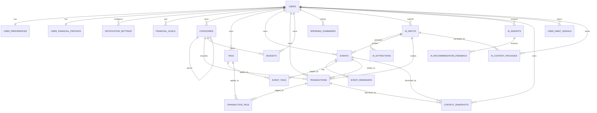

# 我在 PostgreSQL 数据库架构指导

本文档是“我在”项目后续搭建 PostgreSQL 数据库时的权威参考。以后需要创建数据库、写迁移脚本、生成 ORM 模型或改造后端 API 时，先阅读本文档。

## 设计结论

- PostgreSQL 是服务端的数据中心，快应用客户端不直接连接数据库。
- 快应用通过后端 API 读写数据，`@system.storage` 后续只作为本地缓存、离线草稿或迁移来源。
- 当前版本只支持用户记录自己的日程和账目，不做多人分账、不做多账户钱包、不做日程参与者。
- 记账不再依附在日程字段里；日程和交易流水独立存储，必要时通过 `transactions.event_id` 关联。
- 用户总金额由 `user_financial_profiles` 保存，不再建立 `accounts` 表。
- 保留 AI 输入、AI 解析、AI 洞察相关表，为即将接入的 AI 能力预留。
- 保留 `spending_summaries`，但它是统计缓存，不是原始账目来源。
- 为个性化建议新增“情境特征”与“习惯证据”结构。AI 不应只按用户历史原文检索，还应能按天气、时间段、工作日/周末、地点场景、消费/日程场景等条件检索用户习惯。
- 云端 Agent 不直接访问数据库。后端或端侧先检索并打包相关上下文，再把最小必要信息发给云端。

## 相比原始结构图的调整

| 原设计 | 调整后 |
| --- | --- |
| `accounts` 多账户/钱包 | 删除，改用 `user_financial_profiles.current_balance` 表示用户总金额 |
| `transactions.account_id` | 删除 |
| `transactions.type = transfer` | 删除，当前只支持 `income` / `expense` |
| `transaction_splits` 分账/拆分 | 删除，当前只做个人记账 |
| `event_participants` 日程参与人 | 删除，当前只做个人日程 |
| `user_tags` 与 `tags` 重复 | 删除 `user_tags`，统一使用 `tags` |
| `event_type = event/todo/reminder` | 改为 `event_type = schedule/todo`，提醒独立放入 `event_reminders` |
| `events.start_time/end_time` | 改为支持全天日程的 `start_at/end_at` 与 `start_date/end_date` |
| `event_reminders` 面向多人参与提醒 | 改为单用户提醒，保留 `user_id` 方便通知任务和权限过滤 |

## 核心实体

### 用户与设置

- `users`：用户基础信息。
- `user_preferences`：用户偏好，一人一条。
- `user_financial_profiles`：用户财务总览，一人一条，保存总金额和默认币种。
- `notification_settings`：通知设置。

### 日程

- `events`：日程/待办。支持普通时间段日程和全天日程。
- `event_reminders`：日程提醒。
- `event_tags`：日程和标签的多对多关系。

### 记账

- `transactions`：收入/支出流水。
- `categories`：交易分类。
- `budgets`：预算。
- `financial_goals`：财务目标。
- `spending_summaries`：消费统计缓存。
- `transaction_tags`：交易和标签的多对多关系。

### 标签

- `tags`：用户自定义标签，可用于日程或交易。

### AI

- `ai_inputs`：用户原始输入，文本、语音、图片均可。
- `ai_extractions`：AI 结构化解析结果。
- `ai_insights`：AI 生成的建议、提醒、预算分析等。
- `context_snapshots`：日程、账目和 AI 输入对应的情境快照，例如天气、时间段、地点场景、活动场景。
- `user_habit_signals`：从历史记录中沉淀出的用户习惯证据，用于个性化建议检索。
- `ai_context_packages`：记录每次发往云端 Agent 的上下文包摘要，便于审计和调试。
- `ai_recommendation_feedback`：记录用户对 AI 建议的接受、忽略或修改反馈。

## ER 图

可维护的 Mermaid 源文件见 [postgresql-er-diagram.mmd](./postgresql-er-diagram.mmd)。

架构示意图见 [postgresql-er-diagram.svg](./postgresql-er-diagram.svg)。



## 字段设计

### users

| 字段 | 类型 | 说明 |
| --- | --- | --- |
| `id` | `UUID` | 主键 |
| `username` | `VARCHAR(50)` | 用户名 |
| `phone` | `VARCHAR(20)` | 手机号，唯一，可空 |
| `email` | `VARCHAR(100)` | 邮箱，唯一，可空 |
| `avatar_url` | `TEXT` | 头像地址 |
| `created_at` | `TIMESTAMPTZ` | 创建时间 |
| `updated_at` | `TIMESTAMPTZ` | 更新时间 |

### user_preferences

| 字段 | 类型 | 说明 |
| --- | --- | --- |
| `user_id` | `UUID` | 主键，外键到 `users.id` |
| `currency` | `VARCHAR(10)` | 默认币种，例如 `CNY` |
| `timezone` | `VARCHAR(50)` | 用户时区，例如 `Asia/Kuala_Lumpur` |
| `default_view` | `VARCHAR(20)` | 默认视图：`week/month/agenda` |
| `reminder_setting` | `JSONB` | 默认提醒偏好 |
| `created_at` | `TIMESTAMPTZ` | 创建时间 |
| `updated_at` | `TIMESTAMPTZ` | 更新时间 |

### user_financial_profiles

| 字段 | 类型 | 说明 |
| --- | --- | --- |
| `user_id` | `UUID` | 主键，外键到 `users.id` |
| `currency` | `VARCHAR(10)` | 默认币种 |
| `initial_balance` | `NUMERIC(14,2)` | 用户录入的初始总金额 |
| `current_balance` | `NUMERIC(14,2)` | 当前总金额 |
| `created_at` | `TIMESTAMPTZ` | 创建时间 |
| `updated_at` | `TIMESTAMPTZ` | 更新时间 |

`current_balance` 由后端服务在创建、修改、删除 `transactions` 时统一维护。它是总金额快照，不再拆分到银行卡、现金、钱包等账户。

### events

| 字段 | 类型 | 说明 |
| --- | --- | --- |
| `id` | `UUID` | 主键 |
| `user_id` | `UUID` | 所属用户 |
| `title` | `VARCHAR(200)` | 标题 |
| `description` | `TEXT` | 描述 |
| `all_day` | `BOOLEAN` | 是否全天日程 |
| `start_date` | `DATE` | 全天日程开始日期 |
| `end_date` | `DATE` | 全天日程结束日期 |
| `start_at` | `TIMESTAMPTZ` | 非全天日程开始时间 |
| `end_at` | `TIMESTAMPTZ` | 非全天日程结束时间 |
| `timezone` | `VARCHAR(50)` | 日程时区 |
| `location` | `VARCHAR(255)` | 地点 |
| `event_type` | `VARCHAR(20)` | `schedule/todo` |
| `priority` | `VARCHAR(10)` | `low/medium/high` |
| `status` | `VARCHAR(20)` | `active/completed/cancelled` |
| `color` | `VARCHAR(20)` | 前端展示色 |
| `is_recurring` | `BOOLEAN` | 是否重复 |
| `recurrence_rule` | `JSONB` | 重复规则 |
| `source_input_id` | `UUID` | 来源 AI 输入，可空 |
| `created_at` | `TIMESTAMPTZ` | 创建时间 |
| `updated_at` | `TIMESTAMPTZ` | 更新时间 |
| `deleted_at` | `TIMESTAMPTZ` | 软删除时间 |

全天日程使用 `start_date` / `end_date`。普通时间段日程使用 `start_at` / `end_at`。

### transactions

| 字段 | 类型 | 说明 |
| --- | --- | --- |
| `id` | `UUID` | 主键 |
| `user_id` | `UUID` | 所属用户 |
| `event_id` | `UUID` | 关联日程，可空 |
| `category_id` | `UUID` | 分类，可空 |
| `type` | `VARCHAR(20)` | `income/expense` |
| `amount` | `NUMERIC(14,2)` | 金额，必须大于 0 |
| `currency` | `VARCHAR(10)` | 币种 |
| `description` | `TEXT` | 描述 |
| `occurred_at` | `TIMESTAMPTZ` | 发生时间 |
| `payment_method` | `VARCHAR(30)` | 支付方式文本，如 `cash/card/wechat/alipay` |
| `location` | `VARCHAR(255)` | 地点 |
| `is_manual` | `BOOLEAN` | 是否手动录入 |
| `source_input_id` | `UUID` | 来源 AI 输入，可空 |
| `created_at` | `TIMESTAMPTZ` | 创建时间 |
| `updated_at` | `TIMESTAMPTZ` | 更新时间 |
| `deleted_at` | `TIMESTAMPTZ` | 软删除时间 |

`transactions` 不再包含 `account_id`，也不支持 `transfer`。收入增加用户总金额，支出减少用户总金额。

### spending_summaries

| 字段 | 类型 | 说明 |
| --- | --- | --- |
| `id` | `UUID` | 主键 |
| `user_id` | `UUID` | 所属用户 |
| `period_type` | `VARCHAR(10)` | `day/month/year` |
| `period_start` | `DATE` | 周期开始 |
| `period_end` | `DATE` | 周期结束 |
| `total_income` | `NUMERIC(14,2)` | 总收入 |
| `total_expense` | `NUMERIC(14,2)` | 总支出 |
| `balance` | `NUMERIC(14,2)` | 收支差额 |
| `category_breakdown` | `JSONB` | 分类统计详情 |
| `created_at` | `TIMESTAMPTZ` | 创建时间 |
| `updated_at` | `TIMESTAMPTZ` | 更新时间 |

`spending_summaries` 只作为统计缓存或报表加速表。真实账目永远以 `transactions` 为准。

### context_snapshots

`context_snapshots` 用于保存一条日程、账目或 AI 输入发生时的情境特征。它不是原始日程或账目的替代品，而是为了后续检索“用户在什么情境下通常做什么”。

| 字段 | 类型 | 说明 |
| --- | --- | --- |
| `id` | `UUID` | 主键 |
| `user_id` | `UUID` | 所属用户 |
| `source_type` | `VARCHAR(20)` | `event/transaction/ai_input/manual` |
| `event_id` | `UUID` | 关联日程，可空 |
| `transaction_id` | `UUID` | 关联交易，可空 |
| `input_id` | `UUID` | 关联 AI 输入，可空 |
| `occurred_at` | `TIMESTAMPTZ` | 情境发生时间 |
| `date_local` | `DATE` | 用户本地日期，便于本地日历检索 |
| `timezone` | `VARCHAR(50)` | 用户时区 |
| `day_of_week` | `SMALLINT` | 1-7，建议 1 表示周一 |
| `is_weekend` | `BOOLEAN` | 是否周末 |
| `time_bucket` | `VARCHAR(20)` | `early_morning/morning/noon/afternoon/evening/night` |
| `weather_condition` | `VARCHAR(30)` | `sunny/cloudy/rainy/snowy/foggy/windy/unknown` |
| `temperature_bucket` | `VARCHAR(20)` | `cold/cool/mild/warm/hot/unknown` |
| `location_text` | `VARCHAR(255)` | 原始地点文本，可空 |
| `location_scene` | `VARCHAR(50)` | 地点场景，如 `home/work/school/supermarket/restaurant/outdoor/unknown` |
| `activity_scene` | `VARCHAR(50)` | 活动场景，如 `meal/shopping/study/work/commute/social/fitness/errand` |
| `mood` | `VARCHAR(30)` | 情绪或状态，可空 |
| `features` | `JSONB` | 其他情境特征，例如节假日、考试周、是否发薪日 |
| `created_at` | `TIMESTAMPTZ` | 创建时间 |

建议：

- 创建日程和交易时同步生成或更新 `context_snapshots`。
- 天气可以由后端根据时间与城市调用天气服务后写入；缺失时写 `unknown`，不要让模型编造。
- 同一条记录可以先写基础情境，后续异步补充天气、节假日等特征。

### user_habit_signals

`user_habit_signals` 用于沉淀个性化建议的可检索证据。例如“用户在工作日、阴雨天、下午，常选择某类餐饮或某个地点”。

| 字段 | 类型 | 说明 |
| --- | --- | --- |
| `id` | `UUID` | 主键 |
| `user_id` | `UUID` | 所属用户 |
| `signal_type` | `VARCHAR(30)` | `food_preference/spending_pattern/schedule_pattern/location_pattern/time_pattern` |
| `subject_type` | `VARCHAR(30)` | `category/tag/item/location_scene/activity_scene/text_label` |
| `subject_value` | `VARCHAR(100)` | 偏好对象，如 `火锅`、`餐饮`、`supermarket` |
| `context_filter` | `JSONB` | 触发情境，例如 `{"weather_condition":"rainy","time_bucket":"afternoon","is_weekend":false}` |
| `evidence_count` | `INTEGER` | 支持该信号的历史记录数 |
| `confidence` | `NUMERIC(5,4)` | 0-1 置信度 |
| `first_observed_at` | `TIMESTAMPTZ` | 首次观察时间 |
| `last_observed_at` | `TIMESTAMPTZ` | 最近观察时间 |
| `example_refs` | `JSONB` | 少量证据引用，如 event/transaction id 列表，不放原始敏感文本 |
| `status` | `VARCHAR(20)` | `active/stale/rejected` |
| `created_at` | `TIMESTAMPTZ` | 创建时间 |
| `updated_at` | `TIMESTAMPTZ` | 更新时间 |

维护建议：

- 第一阶段可由后端定时从 `events`、`transactions`、`context_snapshots` 聚合生成。
- 不建议每次建议都扫描全量原始记录；先查 `user_habit_signals`，需要解释时再取少量原始记录摘要。
- 用户明确否定某类建议时，将对应信号标记为 `rejected` 或降低 `confidence`。

### ai_context_packages

`ai_context_packages` 记录发往云端 Agent 的上下文包摘要，便于追踪“模型为什么这么建议”。不建议保存完整隐私原文。

| 字段 | 类型 | 说明 |
| --- | --- | --- |
| `id` | `UUID` | 主键 |
| `user_id` | `UUID` | 所属用户 |
| `input_id` | `UUID` | 对应 `ai_inputs.id`，可空 |
| `package_type` | `VARCHAR(30)` | `parse/recommendation/budget/schedule_summary/monthly_summary` |
| `context_keys` | `JSONB` | 包含的上下文类型，如 `schedule_snapshot/budget_snapshot/habit_evidence` |
| `payload_summary` | `JSONB` | 脱敏后的摘要和计数，不保存完整敏感明细 |
| `token_estimate` | `INTEGER` | 估算 token 或字符量 |
| `privacy_level` | `VARCHAR(20)` | `minimal/standard/sensitive` |
| `created_at` | `TIMESTAMPTZ` | 创建时间 |

### ai_recommendation_feedback

`ai_recommendation_feedback` 用于记录用户对 AI 建议的反馈，反向修正习惯信号。

| 字段 | 类型 | 说明 |
| --- | --- | --- |
| `id` | `UUID` | 主键 |
| `user_id` | `UUID` | 所属用户 |
| `insight_id` | `UUID` | 对应 `ai_insights.id` |
| `feedback_type` | `VARCHAR(20)` | `accepted/dismissed/modified/negative` |
| `feedback_text` | `TEXT` | 用户补充说明，可空 |
| `created_at` | `TIMESTAMPTZ` | 创建时间 |

## 情境化建议检索示例

用户问：

```text
今天下午下雨，吃点什么好？
```

推荐后端检索顺序：

1. 标准化当前情境：`weather_condition=rainy`、`time_bucket=afternoon`、`is_weekend=false`。
2. 查询 `user_habit_signals` 中匹配这些情境的 `food_preference` 和 `spending_pattern`。
3. 如果信号不足，再从最近 30-90 天的 `context_snapshots` 关联 `transactions` 取少量候选。
4. 聚合成 `habit_evidence`，脱敏后放入云端 Agent 上下文包。
5. 云端 Agent 只负责表达、权衡和建议；最终推荐展示由后端校验风险和预算。

## 建表 SQL 草案

```sql
CREATE EXTENSION IF NOT EXISTS pgcrypto;

CREATE TABLE users (
  id UUID PRIMARY KEY DEFAULT gen_random_uuid(),
  username VARCHAR(50) NOT NULL,
  phone VARCHAR(20) UNIQUE,
  email VARCHAR(100) UNIQUE,
  avatar_url TEXT,
  created_at TIMESTAMPTZ NOT NULL DEFAULT now(),
  updated_at TIMESTAMPTZ NOT NULL DEFAULT now()
);

CREATE TABLE user_preferences (
  user_id UUID PRIMARY KEY REFERENCES users(id) ON DELETE CASCADE,
  currency VARCHAR(10) NOT NULL DEFAULT 'CNY',
  timezone VARCHAR(50) NOT NULL DEFAULT 'Asia/Shanghai',
  default_view VARCHAR(20) NOT NULL DEFAULT 'week',
  reminder_setting JSONB NOT NULL DEFAULT '{}'::jsonb,
  created_at TIMESTAMPTZ NOT NULL DEFAULT now(),
  updated_at TIMESTAMPTZ NOT NULL DEFAULT now(),
  CONSTRAINT user_preferences_default_view_check
    CHECK (default_view IN ('week', 'month', 'agenda'))
);

CREATE TABLE user_financial_profiles (
  user_id UUID PRIMARY KEY REFERENCES users(id) ON DELETE CASCADE,
  currency VARCHAR(10) NOT NULL DEFAULT 'CNY',
  initial_balance NUMERIC(14,2) NOT NULL DEFAULT 0,
  current_balance NUMERIC(14,2) NOT NULL DEFAULT 0,
  created_at TIMESTAMPTZ NOT NULL DEFAULT now(),
  updated_at TIMESTAMPTZ NOT NULL DEFAULT now()
);

CREATE TABLE notification_settings (
  id UUID PRIMARY KEY DEFAULT gen_random_uuid(),
  user_id UUID NOT NULL REFERENCES users(id) ON DELETE CASCADE,
  channel VARCHAR(20) NOT NULL,
  quiet_start TIME,
  quiet_end TIME,
  enabled BOOLEAN NOT NULL DEFAULT true,
  created_at TIMESTAMPTZ NOT NULL DEFAULT now(),
  updated_at TIMESTAMPTZ NOT NULL DEFAULT now(),
  CONSTRAINT notification_settings_channel_check
    CHECK (channel IN ('push', 'email', 'sms', 'voice')),
  UNIQUE (user_id, channel)
);

CREATE TABLE financial_goals (
  id UUID PRIMARY KEY DEFAULT gen_random_uuid(),
  user_id UUID NOT NULL REFERENCES users(id) ON DELETE CASCADE,
  name VARCHAR(100) NOT NULL,
  target_amount NUMERIC(14,2) NOT NULL,
  current_amount NUMERIC(14,2) NOT NULL DEFAULT 0,
  start_date DATE,
  end_date DATE,
  status VARCHAR(20) NOT NULL DEFAULT 'active',
  created_at TIMESTAMPTZ NOT NULL DEFAULT now(),
  updated_at TIMESTAMPTZ NOT NULL DEFAULT now(),
  CONSTRAINT financial_goals_amount_check
    CHECK (target_amount > 0 AND current_amount >= 0),
  CONSTRAINT financial_goals_status_check
    CHECK (status IN ('active', 'paused', 'achieved'))
);

CREATE TABLE ai_inputs (
  id UUID PRIMARY KEY DEFAULT gen_random_uuid(),
  user_id UUID NOT NULL REFERENCES users(id) ON DELETE CASCADE,
  input_type VARCHAR(20) NOT NULL,
  content TEXT,
  raw_text TEXT,
  image_url TEXT,
  recognized_json JSONB,
  created_at TIMESTAMPTZ NOT NULL DEFAULT now(),
  UNIQUE (user_id, id),
  CONSTRAINT ai_inputs_input_type_check
    CHECK (input_type IN ('text', 'voice', 'image'))
);

CREATE TABLE categories (
  id UUID PRIMARY KEY DEFAULT gen_random_uuid(),
  user_id UUID NOT NULL REFERENCES users(id) ON DELETE CASCADE,
  name VARCHAR(50) NOT NULL,
  type VARCHAR(20) NOT NULL,
  parent_id UUID,
  icon VARCHAR(50),
  color VARCHAR(20),
  created_at TIMESTAMPTZ NOT NULL DEFAULT now(),
  UNIQUE (user_id, id),
  UNIQUE (user_id, name, type),
  CONSTRAINT categories_type_check
    CHECK (type IN ('income', 'expense', 'both')),
  CONSTRAINT categories_parent_fk
    FOREIGN KEY (parent_id)
    REFERENCES categories(id)
    ON DELETE SET NULL
);

CREATE TABLE tags (
  id UUID PRIMARY KEY DEFAULT gen_random_uuid(),
  user_id UUID NOT NULL REFERENCES users(id) ON DELETE CASCADE,
  name VARCHAR(50) NOT NULL,
  color VARCHAR(20),
  created_at TIMESTAMPTZ NOT NULL DEFAULT now(),
  UNIQUE (user_id, id),
  UNIQUE (user_id, name)
);

CREATE TABLE events (
  id UUID PRIMARY KEY DEFAULT gen_random_uuid(),
  user_id UUID NOT NULL REFERENCES users(id) ON DELETE CASCADE,
  title VARCHAR(200) NOT NULL,
  description TEXT,
  all_day BOOLEAN NOT NULL DEFAULT false,
  start_date DATE,
  end_date DATE,
  start_at TIMESTAMPTZ,
  end_at TIMESTAMPTZ,
  timezone VARCHAR(50) NOT NULL DEFAULT 'Asia/Shanghai',
  location VARCHAR(255),
  event_type VARCHAR(20) NOT NULL DEFAULT 'schedule',
  priority VARCHAR(10) NOT NULL DEFAULT 'medium',
  status VARCHAR(20) NOT NULL DEFAULT 'active',
  color VARCHAR(20),
  is_recurring BOOLEAN NOT NULL DEFAULT false,
  recurrence_rule JSONB,
  source_input_id UUID,
  created_at TIMESTAMPTZ NOT NULL DEFAULT now(),
  updated_at TIMESTAMPTZ NOT NULL DEFAULT now(),
  deleted_at TIMESTAMPTZ,
  UNIQUE (user_id, id),
  CONSTRAINT events_source_input_fk
    FOREIGN KEY (source_input_id)
    REFERENCES ai_inputs(id)
    ON DELETE SET NULL,
  CONSTRAINT events_type_check
    CHECK (event_type IN ('schedule', 'todo')),
  CONSTRAINT events_priority_check
    CHECK (priority IN ('low', 'medium', 'high')),
  CONSTRAINT events_status_check
    CHECK (status IN ('active', 'completed', 'cancelled')),
  CONSTRAINT events_time_check
    CHECK (
      (
        all_day = true
        AND start_date IS NOT NULL
        AND end_date IS NOT NULL
        AND end_date >= start_date
        AND start_at IS NULL
        AND end_at IS NULL
      )
      OR
      (
        all_day = false
        AND start_at IS NOT NULL
        AND end_at IS NOT NULL
        AND end_at > start_at
      )
    )
);

CREATE TABLE event_reminders (
  id UUID PRIMARY KEY DEFAULT gen_random_uuid(),
  user_id UUID NOT NULL REFERENCES users(id) ON DELETE CASCADE,
  event_id UUID NOT NULL,
  remind_at TIMESTAMPTZ NOT NULL,
  method VARCHAR(20) NOT NULL DEFAULT 'push',
  is_sent BOOLEAN NOT NULL DEFAULT false,
  created_at TIMESTAMPTZ NOT NULL DEFAULT now(),
  CONSTRAINT event_reminders_event_fk
    FOREIGN KEY (user_id, event_id)
    REFERENCES events(user_id, id)
    ON DELETE CASCADE,
  CONSTRAINT event_reminders_method_check
    CHECK (method IN ('push', 'email', 'sms', 'voice'))
);

CREATE TABLE event_tags (
  user_id UUID NOT NULL REFERENCES users(id) ON DELETE CASCADE,
  event_id UUID NOT NULL,
  tag_id UUID NOT NULL,
  created_at TIMESTAMPTZ NOT NULL DEFAULT now(),
  PRIMARY KEY (event_id, tag_id),
  CONSTRAINT event_tags_event_fk
    FOREIGN KEY (user_id, event_id)
    REFERENCES events(user_id, id)
    ON DELETE CASCADE,
  CONSTRAINT event_tags_tag_fk
    FOREIGN KEY (user_id, tag_id)
    REFERENCES tags(user_id, id)
    ON DELETE CASCADE
);

CREATE TABLE transactions (
  id UUID PRIMARY KEY DEFAULT gen_random_uuid(),
  user_id UUID NOT NULL REFERENCES users(id) ON DELETE CASCADE,
  event_id UUID,
  category_id UUID,
  type VARCHAR(20) NOT NULL,
  amount NUMERIC(14,2) NOT NULL,
  currency VARCHAR(10) NOT NULL DEFAULT 'CNY',
  description TEXT,
  occurred_at TIMESTAMPTZ NOT NULL,
  payment_method VARCHAR(30),
  location VARCHAR(255),
  is_manual BOOLEAN NOT NULL DEFAULT false,
  source_input_id UUID,
  created_at TIMESTAMPTZ NOT NULL DEFAULT now(),
  updated_at TIMESTAMPTZ NOT NULL DEFAULT now(),
  deleted_at TIMESTAMPTZ,
  UNIQUE (user_id, id),
  CONSTRAINT transactions_event_fk
    FOREIGN KEY (event_id)
    REFERENCES events(id)
    ON DELETE SET NULL,
  CONSTRAINT transactions_category_fk
    FOREIGN KEY (category_id)
    REFERENCES categories(id)
    ON DELETE SET NULL,
  CONSTRAINT transactions_source_input_fk
    FOREIGN KEY (source_input_id)
    REFERENCES ai_inputs(id)
    ON DELETE SET NULL,
  CONSTRAINT transactions_type_check
    CHECK (type IN ('income', 'expense')),
  CONSTRAINT transactions_amount_check
    CHECK (amount > 0)
);

CREATE TABLE transaction_tags (
  user_id UUID NOT NULL REFERENCES users(id) ON DELETE CASCADE,
  transaction_id UUID NOT NULL,
  tag_id UUID NOT NULL,
  created_at TIMESTAMPTZ NOT NULL DEFAULT now(),
  PRIMARY KEY (transaction_id, tag_id),
  CONSTRAINT transaction_tags_transaction_fk
    FOREIGN KEY (user_id, transaction_id)
    REFERENCES transactions(user_id, id)
    ON DELETE CASCADE,
  CONSTRAINT transaction_tags_tag_fk
    FOREIGN KEY (user_id, tag_id)
    REFERENCES tags(user_id, id)
    ON DELETE CASCADE
);

CREATE TABLE budgets (
  id UUID PRIMARY KEY DEFAULT gen_random_uuid(),
  user_id UUID NOT NULL REFERENCES users(id) ON DELETE CASCADE,
  category_id UUID,
  period VARCHAR(10) NOT NULL,
  start_date DATE NOT NULL,
  end_date DATE NOT NULL,
  limit_amount NUMERIC(14,2) NOT NULL,
  alert_threshold NUMERIC(5,2) NOT NULL DEFAULT 0.80,
  created_at TIMESTAMPTZ NOT NULL DEFAULT now(),
  updated_at TIMESTAMPTZ NOT NULL DEFAULT now(),
  CONSTRAINT budgets_category_fk
    FOREIGN KEY (category_id)
    REFERENCES categories(id)
    ON DELETE SET NULL,
  CONSTRAINT budgets_period_check
    CHECK (period IN ('day', 'week', 'month', 'year')),
  CONSTRAINT budgets_amount_check
    CHECK (limit_amount > 0 AND alert_threshold > 0 AND alert_threshold <= 1),
  CONSTRAINT budgets_date_check
    CHECK (end_date >= start_date)
);

CREATE TABLE spending_summaries (
  id UUID PRIMARY KEY DEFAULT gen_random_uuid(),
  user_id UUID NOT NULL REFERENCES users(id) ON DELETE CASCADE,
  period_type VARCHAR(10) NOT NULL,
  period_start DATE NOT NULL,
  period_end DATE NOT NULL,
  total_income NUMERIC(14,2) NOT NULL DEFAULT 0,
  total_expense NUMERIC(14,2) NOT NULL DEFAULT 0,
  balance NUMERIC(14,2) NOT NULL DEFAULT 0,
  category_breakdown JSONB NOT NULL DEFAULT '{}'::jsonb,
  created_at TIMESTAMPTZ NOT NULL DEFAULT now(),
  updated_at TIMESTAMPTZ NOT NULL DEFAULT now(),
  CONSTRAINT spending_summaries_period_type_check
    CHECK (period_type IN ('day', 'month', 'year')),
  CONSTRAINT spending_summaries_date_check
    CHECK (period_end >= period_start),
  UNIQUE (user_id, period_type, period_start)
);

CREATE TABLE ai_extractions (
  id UUID PRIMARY KEY DEFAULT gen_random_uuid(),
  input_id UUID NOT NULL REFERENCES ai_inputs(id) ON DELETE CASCADE,
  entity_type VARCHAR(20) NOT NULL,
  parsed_data JSONB NOT NULL,
  confidence NUMERIC(5,4),
  created_at TIMESTAMPTZ NOT NULL DEFAULT now(),
  CONSTRAINT ai_extractions_entity_type_check
    CHECK (entity_type IN ('event', 'transaction', 'task')),
  CONSTRAINT ai_extractions_confidence_check
    CHECK (confidence IS NULL OR (confidence >= 0 AND confidence <= 1))
);

CREATE TABLE ai_insights (
  id UUID PRIMARY KEY DEFAULT gen_random_uuid(),
  user_id UUID NOT NULL REFERENCES users(id) ON DELETE CASCADE,
  insight_type VARCHAR(20) NOT NULL,
  title VARCHAR(200) NOT NULL,
  content TEXT NOT NULL,
  related_data JSONB,
  is_read BOOLEAN NOT NULL DEFAULT false,
  created_at TIMESTAMPTZ NOT NULL DEFAULT now(),
  CONSTRAINT ai_insights_type_check
    CHECK (insight_type IN ('analysis', 'budget', 'advice', 'reminder'))
);

CREATE TABLE context_snapshots (
  id UUID PRIMARY KEY DEFAULT gen_random_uuid(),
  user_id UUID NOT NULL REFERENCES users(id) ON DELETE CASCADE,
  source_type VARCHAR(20) NOT NULL,
  event_id UUID,
  transaction_id UUID,
  input_id UUID,
  occurred_at TIMESTAMPTZ NOT NULL,
  date_local DATE NOT NULL,
  timezone VARCHAR(50) NOT NULL,
  day_of_week SMALLINT NOT NULL,
  is_weekend BOOLEAN NOT NULL,
  time_bucket VARCHAR(20) NOT NULL,
  weather_condition VARCHAR(30) NOT NULL DEFAULT 'unknown',
  temperature_bucket VARCHAR(20) NOT NULL DEFAULT 'unknown',
  location_text VARCHAR(255),
  location_scene VARCHAR(50),
  activity_scene VARCHAR(50),
  mood VARCHAR(30),
  features JSONB NOT NULL DEFAULT '{}'::jsonb,
  created_at TIMESTAMPTZ NOT NULL DEFAULT now(),
  CONSTRAINT context_snapshots_event_fk
    FOREIGN KEY (event_id)
    REFERENCES events(id)
    ON DELETE CASCADE,
  CONSTRAINT context_snapshots_transaction_fk
    FOREIGN KEY (transaction_id)
    REFERENCES transactions(id)
    ON DELETE CASCADE,
  CONSTRAINT context_snapshots_input_fk
    FOREIGN KEY (input_id)
    REFERENCES ai_inputs(id)
    ON DELETE SET NULL,
  CONSTRAINT context_snapshots_source_type_check
    CHECK (source_type IN ('event', 'transaction', 'ai_input', 'manual')),
  CONSTRAINT context_snapshots_day_of_week_check
    CHECK (day_of_week BETWEEN 1 AND 7),
  CONSTRAINT context_snapshots_time_bucket_check
    CHECK (time_bucket IN ('early_morning', 'morning', 'noon', 'afternoon', 'evening', 'night')),
  CONSTRAINT context_snapshots_weather_check
    CHECK (weather_condition IN ('sunny', 'cloudy', 'rainy', 'snowy', 'foggy', 'windy', 'unknown')),
  CONSTRAINT context_snapshots_temperature_check
    CHECK (temperature_bucket IN ('cold', 'cool', 'mild', 'warm', 'hot', 'unknown'))
);

CREATE TABLE user_habit_signals (
  id UUID PRIMARY KEY DEFAULT gen_random_uuid(),
  user_id UUID NOT NULL REFERENCES users(id) ON DELETE CASCADE,
  signal_type VARCHAR(30) NOT NULL,
  subject_type VARCHAR(30) NOT NULL,
  subject_value VARCHAR(100) NOT NULL,
  context_filter JSONB NOT NULL DEFAULT '{}'::jsonb,
  evidence_count INTEGER NOT NULL DEFAULT 0,
  confidence NUMERIC(5,4) NOT NULL DEFAULT 0,
  first_observed_at TIMESTAMPTZ,
  last_observed_at TIMESTAMPTZ,
  example_refs JSONB NOT NULL DEFAULT '[]'::jsonb,
  status VARCHAR(20) NOT NULL DEFAULT 'active',
  created_at TIMESTAMPTZ NOT NULL DEFAULT now(),
  updated_at TIMESTAMPTZ NOT NULL DEFAULT now(),
  CONSTRAINT user_habit_signals_signal_type_check
    CHECK (signal_type IN ('food_preference', 'spending_pattern', 'schedule_pattern', 'location_pattern', 'time_pattern')),
  CONSTRAINT user_habit_signals_subject_type_check
    CHECK (subject_type IN ('category', 'tag', 'item', 'location_scene', 'activity_scene', 'text_label')),
  CONSTRAINT user_habit_signals_confidence_check
    CHECK (confidence >= 0 AND confidence <= 1),
  CONSTRAINT user_habit_signals_evidence_count_check
    CHECK (evidence_count >= 0),
  CONSTRAINT user_habit_signals_status_check
    CHECK (status IN ('active', 'stale', 'rejected')),
  UNIQUE (user_id, signal_type, subject_type, subject_value, context_filter)
);

CREATE TABLE ai_context_packages (
  id UUID PRIMARY KEY DEFAULT gen_random_uuid(),
  user_id UUID NOT NULL REFERENCES users(id) ON DELETE CASCADE,
  input_id UUID REFERENCES ai_inputs(id) ON DELETE SET NULL,
  package_type VARCHAR(30) NOT NULL,
  context_keys JSONB NOT NULL DEFAULT '[]'::jsonb,
  payload_summary JSONB NOT NULL DEFAULT '{}'::jsonb,
  token_estimate INTEGER,
  privacy_level VARCHAR(20) NOT NULL DEFAULT 'minimal',
  created_at TIMESTAMPTZ NOT NULL DEFAULT now(),
  CONSTRAINT ai_context_packages_type_check
    CHECK (package_type IN ('parse', 'recommendation', 'budget', 'schedule_summary', 'monthly_summary')),
  CONSTRAINT ai_context_packages_privacy_level_check
    CHECK (privacy_level IN ('minimal', 'standard', 'sensitive')),
  CONSTRAINT ai_context_packages_token_estimate_check
    CHECK (token_estimate IS NULL OR token_estimate >= 0)
);

CREATE TABLE ai_recommendation_feedback (
  id UUID PRIMARY KEY DEFAULT gen_random_uuid(),
  user_id UUID NOT NULL REFERENCES users(id) ON DELETE CASCADE,
  insight_id UUID NOT NULL REFERENCES ai_insights(id) ON DELETE CASCADE,
  feedback_type VARCHAR(20) NOT NULL,
  feedback_text TEXT,
  created_at TIMESTAMPTZ NOT NULL DEFAULT now(),
  CONSTRAINT ai_recommendation_feedback_type_check
    CHECK (feedback_type IN ('accepted', 'dismissed', 'modified', 'negative'))
);
```

说明：`transactions.event_id`、`transactions.category_id`、`events.source_input_id`、`budgets.category_id` 这类可空引用使用单列外键，便于 `ON DELETE SET NULL` 正常工作。同用户一致性需要由后端服务在写入时校验；`event_tags`、`transaction_tags`、`event_reminders` 这类不可空关系仍使用复合外键防止跨用户误关联。

## 推荐索引

```sql
CREATE INDEX idx_events_user_start_at
  ON events(user_id, start_at)
  WHERE deleted_at IS NULL AND all_day = false;

CREATE INDEX idx_events_user_start_date
  ON events(user_id, start_date)
  WHERE deleted_at IS NULL AND all_day = true;

CREATE INDEX idx_events_user_status
  ON events(user_id, status)
  WHERE deleted_at IS NULL;

CREATE INDEX idx_event_reminders_due
  ON event_reminders(remind_at)
  WHERE is_sent = false;

CREATE INDEX idx_transactions_user_occurred_at
  ON transactions(user_id, occurred_at)
  WHERE deleted_at IS NULL;

CREATE INDEX idx_transactions_user_category
  ON transactions(user_id, category_id)
  WHERE deleted_at IS NULL;

CREATE INDEX idx_transactions_user_type
  ON transactions(user_id, type)
  WHERE deleted_at IS NULL;

CREATE INDEX idx_spending_summaries_user_period
  ON spending_summaries(user_id, period_type, period_start);

CREATE INDEX idx_ai_inputs_user_created_at
  ON ai_inputs(user_id, created_at);

CREATE INDEX idx_context_snapshots_user_context
  ON context_snapshots(user_id, weather_condition, time_bucket, is_weekend, date_local);

CREATE INDEX idx_context_snapshots_user_scene
  ON context_snapshots(user_id, location_scene, activity_scene, occurred_at);

CREATE INDEX idx_context_snapshots_features_gin
  ON context_snapshots USING GIN (features);

CREATE INDEX idx_user_habit_signals_lookup
  ON user_habit_signals(user_id, signal_type, subject_type, subject_value)
  WHERE status = 'active';

CREATE INDEX idx_user_habit_signals_context_gin
  ON user_habit_signals USING GIN (context_filter);

CREATE INDEX idx_ai_context_packages_user_created_at
  ON ai_context_packages(user_id, created_at);
```

## 后端维护规则

### 用户总金额

新增交易时：

- `income`：`current_balance += amount`
- `expense`：`current_balance -= amount`

修改交易时：

- 先撤销旧交易对 `current_balance` 的影响。
- 再应用新交易的影响。

删除交易时：

- 软删除 `transactions.deleted_at`。
- 同时撤销该交易对 `current_balance` 的影响。

这些操作应放在同一个数据库事务中执行。

### 消费统计缓存

`spending_summaries` 可以通过两种方式维护：

- 简单阶段：每次打开统计页时按需刷新当前周期。
- 稳定阶段：交易变更后异步刷新相关日/月/年统计。

统计缓存失效时，重新从 `transactions` 聚合生成，不能反向修改原始交易。

### AI 输入与解析

AI 功能建议采用以下流程：

1. 用户输入文本、语音或图片，先写入 `ai_inputs`。
2. AI 服务解析后写入 `ai_extractions`。
3. 如果用户确认生成日程，写入 `events.source_input_id`。
4. 如果用户确认生成账目，写入 `transactions.source_input_id`。
5. 如果 AI 生成分析或建议，写入 `ai_insights`。

### 情境快照与习惯信号

建议后端按以下规则维护：

1. 日程或交易确认写入后，同步创建 `context_snapshots` 基础记录。
2. 天气、节假日、城市等可能异步获取的特征，可以后补到 `features` 或相关字段。
3. 每日或每周从 `context_snapshots`、`events`、`transactions` 聚合更新 `user_habit_signals`。
4. 聚合时至少考虑 `weather_condition`、`time_bucket`、`is_weekend`、`location_scene`、`activity_scene`、`category_id`。
5. `user_habit_signals.confidence` 应随证据数量、最近活跃度和用户反馈调整。
6. 用户拒绝某类建议时，写入 `ai_recommendation_feedback`，并降低或停用对应习惯信号。

### 云端上下文包审计

调用蓝心九问 Agent 前，后端应写入 `ai_context_packages`：

- `context_keys` 记录实际包含了哪些上下文，例如 `["budget_snapshot", "habit_evidence"]`。
- `payload_summary` 只保存脱敏摘要、数量和关键统计，不保存完整原始输入、完整地点、完整交易流水。
- `privacy_level` 如果为 `sensitive`，日志和排查页面应默认隐藏详情。

## 当前本地数据迁移规则

当前快应用本地 `events` 数据大致包含：

```js
{
  id,
  date,
  startHour,
  startMinute,
  endHour,
  endMinute,
  title,
  location,
  amount,
  category,
  color
}
```

迁移到 PostgreSQL 时：

1. 每条本地 event 都创建一条 `events`。
2. `date + startHour/startMinute` 组合成 `events.start_at`。
3. `date + endHour/endMinute` 组合成 `events.end_at`。
4. `title`、`location`、`color` 直接映射。
5. 如果 `amount > 0`，额外创建一条 `transactions`。
6. `transactions.event_id` 指向刚创建的 `events.id`。
7. `category` 先查找或创建同名 `categories`，再写入 `transactions.category_id`。
8. 迁移完成后，根据所有交易重算 `user_financial_profiles.current_balance` 和 `spending_summaries`。

## 第一阶段建议落地顺序

1. 创建 `users`、`user_preferences`、`user_financial_profiles`。
2. 创建 `ai_inputs`、`categories`、`tags`。
3. 创建 `events`、`event_reminders`、`event_tags`。
4. 创建 `transactions`、`transaction_tags`。
5. 创建 `budgets`、`financial_goals`、`spending_summaries`。
6. 创建 `ai_extractions`、`ai_insights`。
7. 创建 `context_snapshots`、`user_habit_signals`、`ai_context_packages`、`ai_recommendation_feedback`。
8. 实现后端 API。
9. 编写本地 `events` 到 PostgreSQL 的迁移脚本。

## 后端 API 建议

```txt
GET    /api/events
POST   /api/events
PUT    /api/events/:id
DELETE /api/events/:id

GET    /api/transactions
POST   /api/transactions
PUT    /api/transactions/:id
DELETE /api/transactions/:id

GET    /api/categories
POST   /api/categories

GET    /api/user/financial-profile
PUT    /api/user/financial-profile

GET    /api/spending-summaries
POST   /api/ai/inputs
GET    /api/ai/insights
POST   /api/ai/context-packages
GET    /api/ai/habit-signals
POST   /api/ai/recommendation-feedback
```

## 不做的能力

当前架构明确不做：

- 多账户钱包。
- 账户间转账。
- 多人分账。
- 日程参与者。
- 共享日程权限。

这些能力如果未来要做，应作为第二套扩展设计，不要把第一版个人记账模型复杂化。
